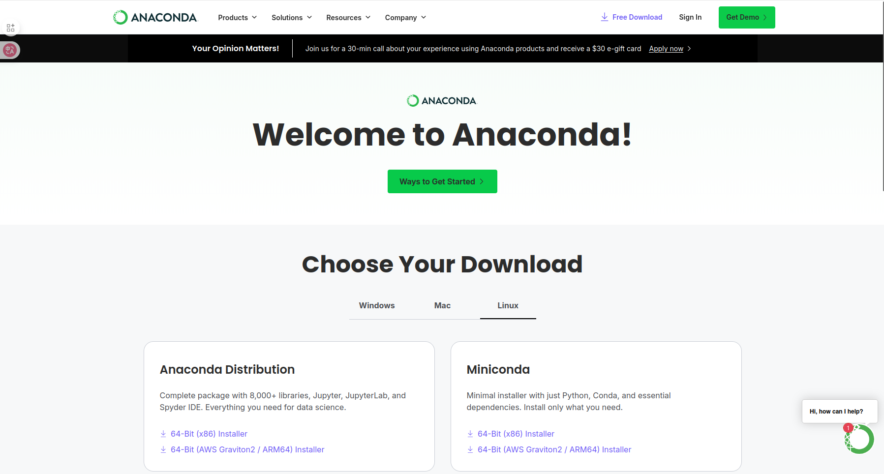
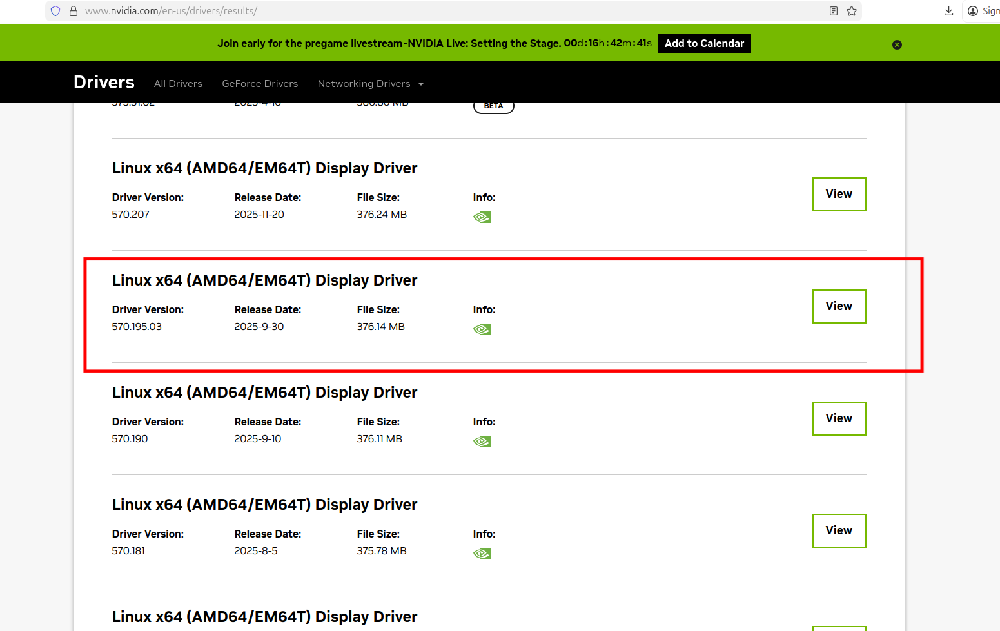
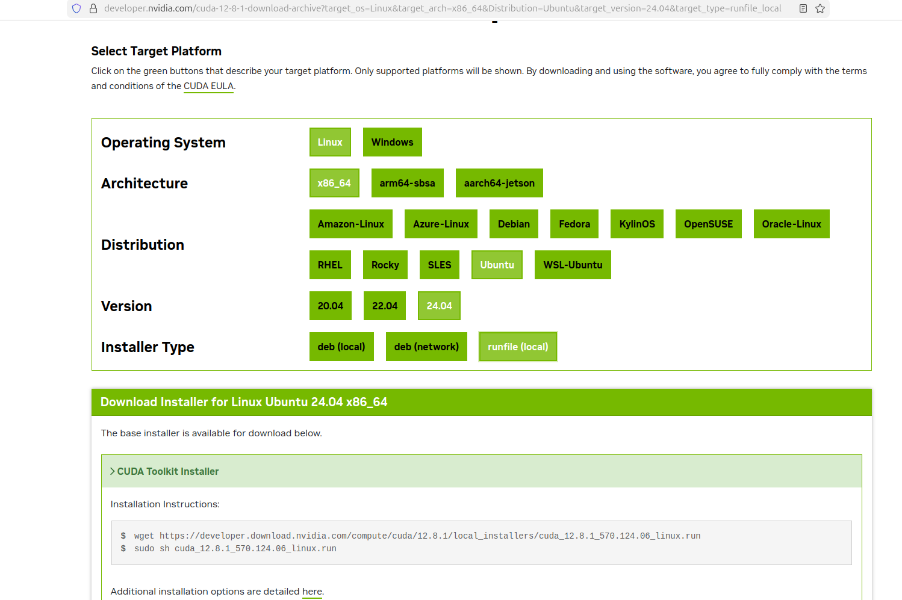
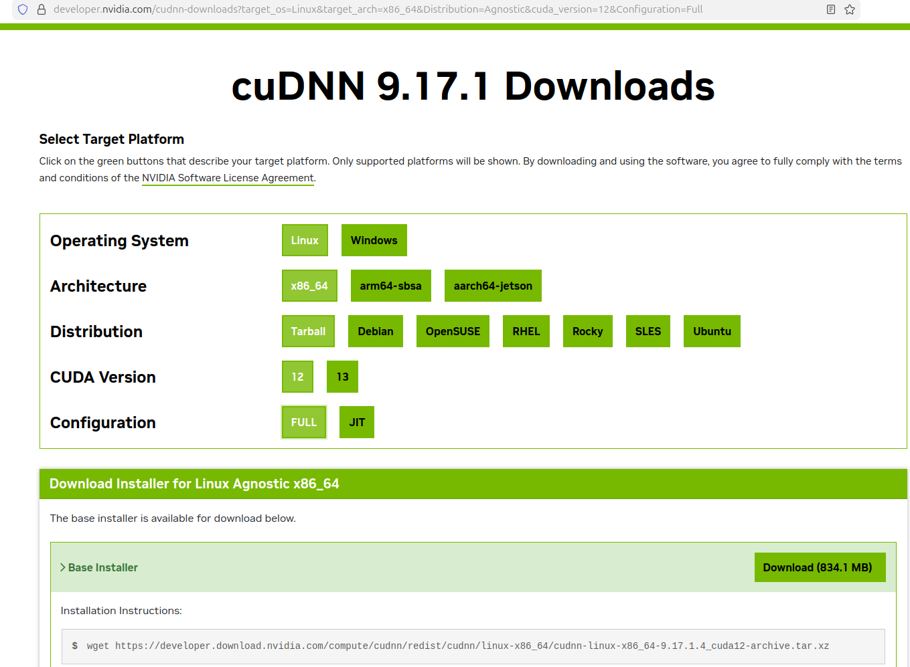
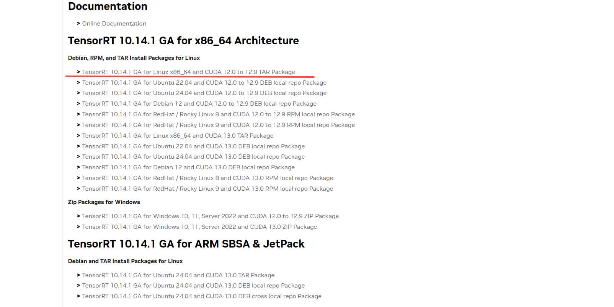
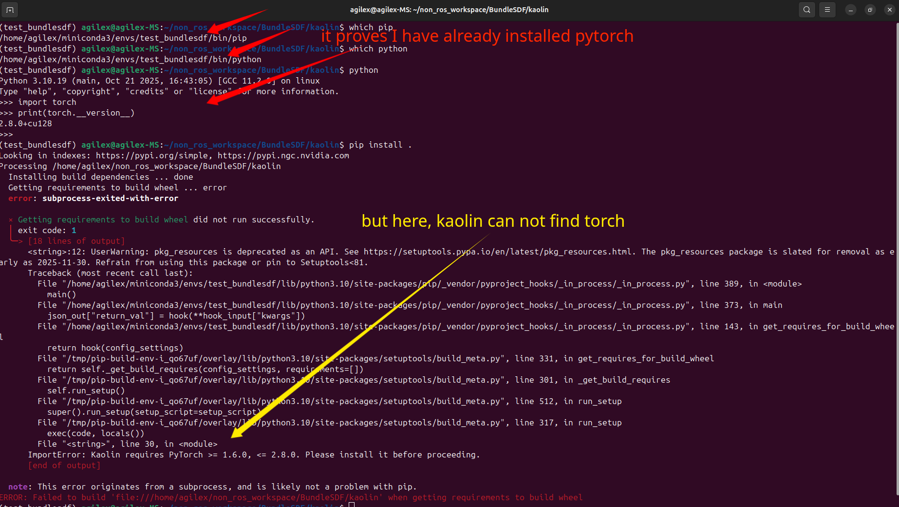
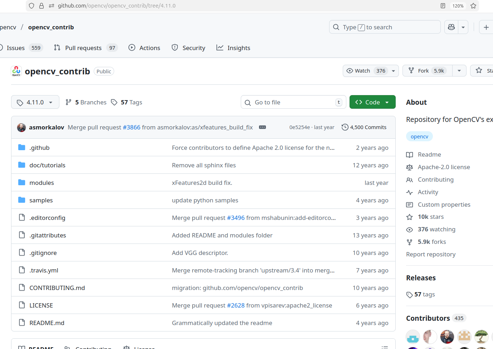

# BundleSDF Environment Configuration Tutorial (For NVIDIA 50 Series GPUs)

[](https://ubuntu.com/)

|[中文]()|[English]()|

**This setup document is for Nvidia 50series GPU, some spacial tips**

[FoundationPose](https://github.com/NVlabs/FoundationPose) is a model for 6D object pose estimation and tracking

## setup anaconda/miniconda

Download anaconda/miniconda on [official site](https://www.anaconda.com/download/success)

1. choose your satisfied verision and download or derectly download in  following cmd
```bash
wget https://repo.anaconda.com/archive/Anaconda3-2025.12-1-Linux-x86_64.sh
```

It looks like this.


2. change this **`.sh`** script ownership and run it

```bash
sudo chmod +x ./Anaconda3-2025.12-1-Linux-x86_64.sh

bash ./Anaconda3-2025.12-1-Linux-x86_64.sh
```
then agree anaconda TOS and set default directory

3. set your conda enviroment and make it will not disturb your origin enviroment

so we should keep conda in autoactivative but we no longer have to deactivate it every time after opening the terminal.

```bash
echo "conda deactivate" >> ~/.bashrc
```

## setup your cuda enviroment

1. download and install nvidia driver

- for Nvidia 50series GPUs, we recommand older versions for fitting the older project like FoundationPose, So this tutorial we use **driver version: 570.195.03** and **cuda version: 12.8**



- reboot

2. download and install cuda

- we can find all versions in this [archive](https://developer.nvidia.com/cuda-toolkit-archive), and we choose cuda version: 12.8


- set PATH
```bash
vim ~/.bashrc
export PATH="/usr/local/cuda-12.8/bin:$PATH"
export LD_LIBRARY_PATH="/usr/local/cuda-12.8/lib64:$LD_LIBRARY_PATH"
```

3. download libcudnn and install 

- download Tarball
```bash
wget https://developer.download.nvidia.com/compute/cudnn/redist/cudnn/linux-x86_64/cudnn-linux-x86_64-9.17.1.4_cuda12-archive.tar.xz
```



- and unzip it and install 

```bash
cd ./cudnn-linux-x86_64-9.16.0.29_cuda12-archive
sudo cp ./lib/libcudnn* /usr/local/cuda/lib64
sudo cp ./include/cudnn*.h /usr/local/cuda/include
sudo chmod a+r /usr/local/cuda/include/cudnn*.h /usr/local/cuda/lib64/libcudnn*
```

4. download TensorRT and install

- we can find all tensorrt version in [tensorrt archive](https://developer.nvidia.com/tensorrt/download/10x), we just install the newest version 

- unzip it 
```bash
cd TensorRT-10.14.1.48.Linux.x86_64-gnu.cuda-12.9/
sudo mv TensorRT-10.14.1.48/ /usr/local/
```
- set PATH
```bash
echo "export LD_LIBRARY_PATH="/usr/local/TensorRT-10.14.1.48/lib:$LD_LIBRARY_PATH"">>~/.bashrc
```

## Configure the BundleSDF Environment

```bash
# Create a new conda environment
conda create -n bundlesdf python=3.10

# Activate the environment
conda activate bundlesdf

pip install pyyaml typeguard resolver

# Install PyTorch (compatible with CUDA 12.8)
pip install torch==2.8.0 torchvision==0.23.0 torchaudio==2.8.0 --index-url https://download.pytorch.org/whl/cu128

# Install required Python libraries
pip install albumentations ray einops kornia loguru yacs tqdm autopep8 jupyterlab matplotlib pytorch-lightning joblib h5py trimesh wandb matplotlib imageio tqdm open3d ruamel.yaml sacred kornia pymongo pyrender jupyterlab scipy scikit-learn yacs einops transformations xatlas pymeshlab cython dearpygui

# Ensure numpy version compatibility
pip install --upgrade numpy scipy

# Uninstall opencv-python
pip uninstall opencv-python

```

Next, configure a virtual C++ environment via conda (Although most conda users use it to manage Python virtual environments, conda can also effectively manage C++ environments. This will be explained in more detail later).

Install required C++ libraries in the virtual environment:

```bash
conda install -c conda-forge \
    gcc=14 gxx=14 boost=1.74 eigen=5.0.1 cmake ninja make gxx_linux-64\
    sysroot_linux-64 libdc1394 \
    yaml-cpp pybind11 zeromq cppzmq jsoncpp \
    freeglut glew mesa-libgl-devel-cos7-x86_64 \
    libblas libcblas liblapacke cudnn mesa-libgl-cos7-x86_64 \ 
    mesa-dri-drivers-cos7-x86_64 ffmpeg gstreamer gst-plugins-base \
    gst-plugins-good gst-plugins-bad gst-plugins-ugly jpeg libtiff \
    libpng openjpeg webp libopenjp2 openh264 glib flann -y

conda install protobuf
```

Set environment variables in the virtual environment to use the host system's CUDA (Method for using CUDA C++ in conda).

```bash
conda activate bundlesdf

export CUDA_HOME=/usr/local/cuda-12.8
export FORCE_CUDA=1

```

- Then compile and install kaolin into the virtual environment.
  
```bash
git clone https://github.com/NVIDIAGameWorks/kaolin.git
cd kaolin
# Only compile
python setup.py build_ext --inplace
# Only install, do not compile again
pip install . --no-build-isolation
```

If you install kaolin directly via pip install ., the following situation may occur:



So my solution is the separate compile and install method above.

If I use the separate compile and install method above, kaolin installs normally.

- Then compile and install PyTorch3D into the virtual environment.

```bash
git clone -b stable https://github.com/facebookresearch/pytorch3d.git
cd pytorch3d
# Only compile
python setup.py build_ext --inplace
# Only install, do not compile again
pip install . --no-build-isolation
```

- Compile and install OpenCV into the virtual environment.

Download OpenCV-4.11 and the corresponding version of OpenCV-contrib.


and[opencv-contirb](https://github.com/opencv/opencv_contrib/tree/4.11.0)



```bash
cd opencv
# Note the path to your opencv-contrib
git clone -b 4.11.0 https://github.com/opencv/opencv_contrib.git
```

Set environment variables so the virtual environment can use the host's CUDA and the virtual environment's gcc and g++.

```bash
export CMAKE_PREFIX_PATH=$CONDA_PREFIX
export CUDA_HOME=/usr/local/cuda-12.8
export CC=$(which x86_64-conda-linux-gnu-gcc)
export CXX=$(which x86_64-conda-linux-gnu-g++)

cmake ..  \
-DCMAKE_BUILD_TYPE=Release \
-DBUILD_CUDA_STUBS=OFF \
-DBUILD_DOCS=OFF \
-DWITH_MATLAB=OFF \
-Dopencv_dnn_BUILD_TORCH_IMPORTE=OFF \
-DCUDA_FAST_MATH=ON \
-DMKL_WITH_OPENMP=ON \
-DOPENCV_ENABLE_NONFREE=ON \
-DWITH_OPENMP=ON \
-DWITH_QT=ON -DWITH_OPENEXR=ON \
-DENABLE_PRECOMPILED_HEADERS=OFF \
-DBUILD_opencv_cudacodec=OFF \
-DINSTALL_PYTHON_EXAMPLES=OFF \
-DWITH_TIFF=OFF \
-DWITH_WEBP=OFF \
-DWITH_FFMPEG=ON \
-DOPENCV_EXTRA_MODULES_PATH=../opencv_contrib/modules \
-DCMAKE_CXX_FLAGS=-std=c++17 \
-DENABLE_CXX11=OFF \
-DBUILD_opencv_xfeatures2d=OFF \
-DOPENCV_DNN_OPENCL=OFF \
-DWITH_CUDA=ON \
-DWITH_OPENCL=OFF \
-DBUILD_opencv_wechat_qrcode=OFF \
-DCMAKE_CXX_STANDARD=17 \
-DCMAKE_CXX_STANDARD_REQUIRED=ON \
-DOPENCV_CUDA_OPTIONS_opencv_test_cudev=-std=c++17 \
-DCUDA_ARCH_BIN="8.9" \
-DINSTALL_PKGCONFIG=ON \
-DOPENCV_GENERATE_PKGCONFIG=ON \
-DINSTALL_PYTHON_EXAMPLES=OFF \
-DINSTALL_C_EXAMPLES=OFF \
-DCMAKE_INSTALL_PREFIX=$CONDA_PREFIX \
-DCMAKE_PREFIX_PATH=$CONDA_PREFIX \
-DCMAKE_INCLUDE_PATH=$CONDA_PREFIX/include \
-DCMAKE_LIBRARY_PATH=$CONDA_PREFIX/lib  

make -j32

make install 
```

- Compile and install PCL 1.10.0 into the virtual environment.

```bash
git clone -b pcl-1.10.0 https://github.com/PointCloudLibrary/pcl.git
```

```bash
cd pcl
mkdir build 
cd build

cmake .. \
-DCMAKE_INSTALL_PREFIX=$CONDA_PREFIX \
-DCMAKE_PREFIX_PATH=$CONDA_PREFIX \
-DCMAKE_BUILD_TYPE=Release \
-DBUILD_apps=OFF \
-DBUILD_GPU=OFF \
-DBUILD_CUDA=OFF \
-DBUILD_examples=OFF \
-DBUILD_global_tests=OFF \
-DBUILD_simulation=OFF \
-DCUDA_BUILD_EMULATION=OFF \
-DCMAKE_CXX_FLAGS="-std=c++14 -include cassert" \
-DPCL_ENABLE_SSE=ON \
-DPCL_SHARED_LIBS=ON \
-DWITH_VTK=OFF \
-DPCL_ONLY_CORE_POINT_TYPES=ON \
-DPCL_COMMON_WARNINGS=OFF \
-DBOOST_ROOT=$CONDA_PREFIX \
-DBoost_NO_SYSTEM_PATHS=ON \
-DBoost_NO_BOOST_CMAKE=ON \
-DBoost_DEBUG=ON \
-DCMAKE_C_COMPILER=$(which x86_64-conda-linux-gnu-gcc) \
-DCMAKE_CXX_COMPILER=$(which x86_64-conda-linux-gnu-g++) \
-DFLANN_ROOT=$CONDA_PREFIX \
-DEIGEN_ROOT=$CONDA_PREFIX \
-DWITH_OPENNI=OFF \
-DWITH_LIBUSB=OFF \
-DWITH_PNG=OFF \
-DWITH_QHULL=OFF \
-DWITH_PCAP=OFF

make -j32

make install

```

- Build `mycuda`

```bash
cd your_BundleSDF_path
cd BundleSDF/
ROOT=$(pwd)

# Set PyTorch library path
export LD_LIBRARY_PATH="/usr/local/lib/python3.10/dist-packages/torch/lib:$LD_LIBRARY_PATH"
export TORCH_LIBRARIES="/usr/local/lib/python3.10/dist-packages/torch/lib"

# Additional PyTorch environment variables
export TORCH_CUDA_ARCH_LIST="7.0;7.5;8.0;8.6;9.0"
export FORCE_CUDA=1
export TORCH_EXTENSIONS_DIR="/tmp/torch_extensions"

# Ensure PyTorch can be found
export PYTHONPATH="/usr/local/lib/python3.10/dist-packages:$PYTHONPATH"

# Print debug info
echo "LD_LIBRARY_PATH: $LD_LIBRARY_PATH"
echo "PYTHONPATH: $PYTHONPATH"
echo "Testing PyTorch import..."
python3 -c "import torch; print('PyTorch version:', torch.__version__); print('CUDA available:', torch.cuda.is_available())"

cd mycuda

python setup.py build_ext --inplace

pip install . --no-build-isolation
```

- Build `BundleTrack`

Modify `CmakeLists.txt` to:

<details><summary>Expand CMakeLists.txt</summary>

```bash
# Copyright (c) 2023, NVIDIA CORPORATION.  All rights reserved.
#
# NVIDIA CORPORATION and its licensors retain all intellectual property
# and proprietary rights in and to this software, related documentation
# and any modifications thereto.  Any use, reproduction, disclosure or
# distribution of this software and related documentation without an express
# license agreement from NVIDIA CORPORATION is strictly prohibited.
cmake_minimum_required(VERSION 3.5)
project(BundleTrack LANGUAGES CUDA CXX C)

set(Python3_ROOT_DIR $ENV{CONDA_PREFIX})
set(Python_ROOT_DIR $ENV{CONDA_PREFIX})
set(Python3_FIND_REGISTRY NEVER)
set(Python3_FIND_STRATEGY LOCATION)
set(Python_FIND_REGISTRY NEVER)
set(Python_FIND_STRATEGY LOCATION)
include_directories(BEFORE $ENV{CONDA_PREFIX}/include)

# Set build type if not specified
if(NOT CMAKE_BUILD_TYPE)
    set(CMAKE_BUILD_TYPE Release)
endif()

# Set output directories
set(CMAKE_LIBRARY_OUTPUT_DIRECTORY ${CMAKE_BINARY_DIR})
set(CMAKE_RUNTIME_OUTPUT_DIRECTORY ${CMAKE_BINARY_DIR})

# Enable CUDA support
enable_language(CUDA)
include(CheckLanguage)
check_language(CUDA)

# Set C++17 standard once
set(CMAKE_CXX_STANDARD 17)
set(CMAKE_CXX_STANDARD_REQUIRED ON)
set(CMAKE_CXX_EXTENSIONS OFF)
set(CMAKE_EXPORT_COMPILE_COMMANDS ON)

# Base flags with warnings
set(CMAKE_CXX_FLAGS "${CMAKE_CXX_FLAGS} -Wall -g")

# CUDA configuration
set(CMAKE_CUDA_STANDARD 17)
set(CMAKE_CUDA_STANDARD_REQUIRED ON)
set(CMAKE_CUDA_FLAGS "${CMAKE_CUDA_FLAGS} -O3 -use_fast_math --default-stream per-thread")

# Check CUDA version for architecture compatibility
if(${CMAKE_CUDA_COMPILER_VERSION} VERSION_LESS "11.0")
    message(WARNING "CUDA version < 11.0 may not support all specified architectures")
endif()

# Set CUDA architectures based on CUDA version
if(${CMAKE_CUDA_COMPILER_VERSION} VERSION_GREATER_EQUAL "11.8")
    set(CMAKE_CUDA_ARCHITECTURES "52;60;61;70;75;80;86;89;90")
else()
    set(CMAKE_CUDA_ARCHITECTURES "52;60;61;70;75;80;86;89")
endif()

# Feature flags
add_definitions(-DG2O=0)
add_definitions(-DTIMER=0)
add_definitions(-DPRINT_RESIDUALS_DENSE=0)
add_definitions(-DPRINT_RESIDUALS_SPARSE=0)
add_definitions(-DCUDA_RANSAC=1)
add_definitions(-DCUDA_MATCHING=1)

# RPATH settings
set(CMAKE_SKIP_BUILD_RPATH FALSE)
set(CMAKE_BUILD_WITH_INSTALL_RPATH TRUE)
set(CMAKE_INSTALL_RPATH "${CMAKE_BINARY_DIR}")
set(CMAKE_INSTALL_RPATH_USE_LINK_PATH TRUE)

# Find required packages with version specifications where appropriate
find_package(Boost 1.65.0 REQUIRED COMPONENTS system program_options serialization)
# find_package(PkgConfig REQUIRED)
# pkg_check_modules(JSONCPP REQUIRED jsoncpp)

find_package(PCL 1.10 REQUIRED COMPONENTS common io filters registration features segmentation kdtree search visualization)
find_package(Eigen3 REQUIRED)
find_package(OpenCV 4.11 REQUIRED)
find_package(OpenMP REQUIRED)
find_package(yaml-cpp 0.6 REQUIRED)
find_package(BLAS REQUIRED)
find_package(OpenGL REQUIRED)
find_package(CUDA 12.8 REQUIRED)
find_package(GLUT REQUIRED)
find_package(LAPACK REQUIRED)
# find_package(pybind11 2.6 REQUIRED)
# find_package(Python COMPONENTS Interpreter Development REQUIRED)
find_package(Python3 COMPONENTS Interpreter Development REQUIRED)

# Verify Python is from Conda environment
message(STATUS "Python interpreter: ${Python3_EXECUTABLE}")
message(STATUS "Python includes: ${Python3_INCLUDE_DIRS}")

set(PYTHON_EXECUTABLE ${Python3_EXECUTABLE})
set(PYTHON_INCLUDE_DIRS ${Python3_INCLUDE_DIRS})
set(PYTHON_LIBRARIES ${Python3_LIBRARIES})

# Then find pybind11 (it will use the already found Python)
find_package(pybind11 2.6 REQUIRED)
find_package(ZeroMQ QUIET)
if(NOT ZeroMQ_FOUND)
    find_library(ZMQ_LIB zmq)
    if(NOT ZMQ_LIB)
        message(FATAL_ERROR "ZeroMQ library not found")
    endif()
endif()

set(PYBIND11_CPP_STANDARD -std=c++17)

# Include directories
include_directories(
    src
    ${Boost_INCLUDE_DIRS}
    ${PYTHON_INCLUDE_DIRS}
    ${EIGEN3_INCLUDE_DIR}
    ${GLUT_INCLUDE_DIRS}
    ${CUDA_INCLUDE_DIRS}
    ${OpenCV_INCLUDE_DIRS}
    ${PCL_INCLUDE_DIRS}
    ${OPENGL_INCLUDE_DIR}
    ${CSPARSE_INCLUDE_DIR}
    ${PROJECT_SOURCE_DIR}/src
    ${PROJECT_SOURCE_DIR}/src/cuda/
    ${PROJECT_SOURCE_DIR}/src/cuda/Solver/
    ${PROJECT_SOURCE_DIR}/src/Thirdparty
    ${PROJECT_SOURCE_DIR}/src/Thirdparty/g2o
)

# Optional Gurobi support
if(DEFINED GUROBI)
    message("Using Gurobi")
    add_definitions(-DGUROBI=1)
    if(NOT DEFINED GUROBI_HOME)
        message(FATAL_ERROR "GUROBI_HOME must be defined when using Gurobi")
    endif()
    include_directories("${GUROBI_HOME}/include")
    find_library(GUROBI_LIBRARY
        NAMES gurobi90 gurobi95
        PATHS "${GUROBI_HOME}/lib"
        REQUIRED
    )
    find_library(GUROBI_CXX_LIBRARY
        NAMES gurobi_c++
        PATHS "${GUROBI_HOME}/lib"
        REQUIRED
    )
endif()

# Source files
file(GLOB MY_SRC 
    ${PROJECT_SOURCE_DIR}/src/*.cpp 
    ${PROJECT_SOURCE_DIR}/src/cuda/*.cpp 
    ${PROJECT_SOURCE_DIR}/src/cuda/Solver/*.cpp
)

file(GLOB G2O_LIBS ${PROJECT_SOURCE_DIR}/src/Thirdparty/g2o/lib/libg2o*)

# Remove problematic PCL components if present
list(REMOVE_ITEM PCL_LIBRARIES pcl_simulation)

# CUDA files
file(GLOB CUDA_FILES
    "${PROJECT_SOURCE_DIR}/src/*.cu"
    "${PROJECT_SOURCE_DIR}/src/cuda/*.cu"
    "${PROJECT_SOURCE_DIR}/src/cuda/Solver/*.cu"
)

# Build CUDA library
add_library(MY_CUDA_LIB SHARED ${CUDA_FILES})
set_target_properties(MY_CUDA_LIB PROPERTIES 
    CUDA_SEPARABLE_COMPILATION ON
    POSITION_INDEPENDENT_CODE ON
    LIBRARY_OUTPUT_DIRECTORY ${CMAKE_BINARY_DIR}
)
target_link_libraries(MY_CUDA_LIB PUBLIC
    yaml-cpp
    ${YAML_CPP_LIBRARIES}
    ${Boost_LIBRARIES}
    ${OpenCV_LIBRARIES}
    ${PCL_LIBRARIES}
    ${CUDA_LIBRARIES}
)

# Main library
add_library(${PROJECT_NAME} SHARED ${MY_SRC})
set_target_properties(${PROJECT_NAME} PROPERTIES
    LIBRARY_OUTPUT_DIRECTORY ${CMAKE_BINARY_DIR}
    POSITION_INDEPENDENT_CODE ON
)
target_link_libraries(${PROJECT_NAME} PUBLIC
    ${YAML_CPP_LIBRARIES}
    MY_CUDA_LIB
    ${Boost_LIBRARIES}
    ${OpenCV_LIBRARIES}
    ${PCL_LIBRARIES}
    ${OpenMP_CXX_FLAGS}
    ${OPENGL_LIBRARIES}
    ${CUDA_LIBRARIES}
    ${GLUT_LIBRARIES}
    ${PYTHON_LIBRARIES}
    ${G2O_LIBS}
    zmq
)

if(DEFINED GUROBI)
    target_link_libraries(${PROJECT_NAME} PUBLIC ${GUROBI_LIBRARY} ${GUROBI_CXX_LIBRARY})
endif()

# Python bindings
pybind11_add_module(my_cpp 
    pybind_interface/pybind_api.cpp
    src/Frame.cpp
)
set_target_properties(my_cpp PROPERTIES 
    LIBRARY_OUTPUT_DIRECTORY ${CMAKE_BINARY_DIR}
    POSITION_INDEPENDENT_CODE ON
    CUDA_SEPARABLE_COMPILATION ON
)
target_link_libraries(my_cpp PRIVATE 
    ${PROJECT_NAME}
    MY_CUDA_LIB
    yaml-cpp
    ${YAML_CPP_LIBRARIES}
    ${Boost_LIBRARIES}
    ${OpenCV_LIBRARIES}
    ${PCL_LIBRARIES}
    ${OPENGL_LIBRARIES}
    ${GLUT_LIBRARIES}
    ${CUDA_LIBRARIES}
    ${CUDA_CUDART_LIBRARY}
    ${PYTHON_LIBRARIES}
    ${OpenMP_CXX_FLAGS}
    zmq
)

```

</details>

Then compile.

```bash
cd BundleTrack/
rm -rf build && mkdir build && cd build && cmake .. && make -j32
```

## Run

- Prepare example data

Download [example milk data](https://drive.google.com/file/d/1akutk_Vay5zJRMr3hVzZ7s69GT4gxuWN/view)

- Download the required weights

Download [Xmem权重](https://drive.google.com/file/d/1MEZvjbBdNAOF7pXcq6XPQduHeXB50VTc/view) and place it at `./BundleTrack/XMem/saves/XMem-s012.pth`

Download [LoFTR_out_door_ds.ckpt](https://drive.google.com/drive/folders/1xu2Pq6mZT5hmFgiYMBT9Zt8h1yO-3SIp) and place it at `./BundleTrack/LoFTR/weights/outdoor_ds.ckpt`

- Execute the command

```bash
# Note the file paths
python run_custom.py --mode run_video --video_dir /home/agilex/non_ros_workspace/BundleSDF/dataset/2022-11-18-15-10-24_milk --out_folder /home/agilex/non_ros_workspace/BundleSDF/result/bundlesdf_2022-11-18-15-10-24_milk --use_segmenter 1 --use_gui 1 --debug_level 2
```

