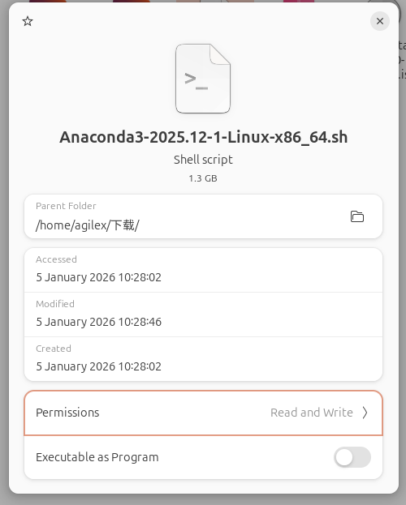
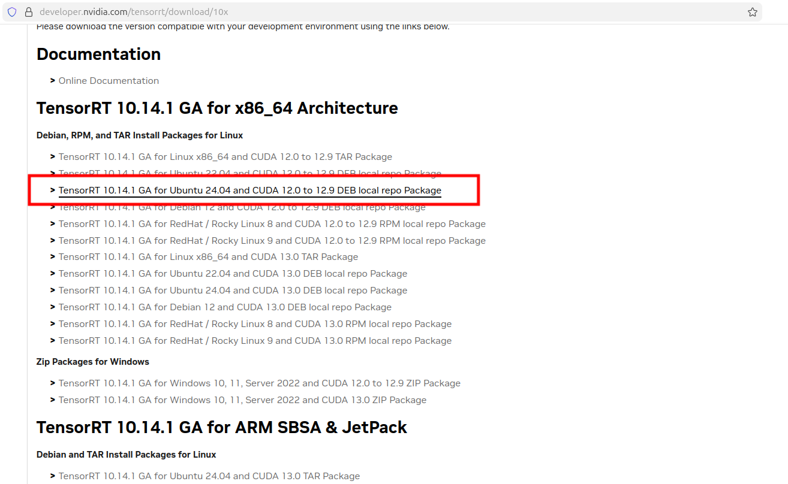

# FoundationPose environment setup tutorialfor Nvidia 50series GPUs
[](https://ubuntu.com/)

|[中文]()|[English]()|

**This setup document is for Nvidia 50series GPU, some spacial tips**

[FoundationPose](https://github.com/NVlabs/FoundationPose) is a model for 6D object pose estimation and tracking

## setup anaconda/miniconda

Download anaconda/miniconda on [official site](https://www.anaconda.com/download/success)

1. choose your satisfied verision and download or derectly download in  following cmd
```bash
wget https://repo.anaconda.com/archive/Anaconda3-2025.12-1-Linux-x86_64.sh
```

It looks like this.


2. change this **`.sh`** script ownership and run it

```bash
sudo chmod +x ./Anaconda3-2025.12-1-Linux-x86_64.sh

bash ./Anaconda3-2025.12-1-Linux-x86_64.sh
```
then agree anaconda TOS and set default directory

3. set your conda enviroment and make it will not disturb your origin enviroment

so we should keep conda in autoactivative but we no longer have to deactivate it every time after opening the terminal.

```bash
echo "conda deactivate" >> ~/.bashrc
```

## setup your cuda enviroment

1. download and install nvidia driver

- for Nvidia 50series GPUs, we recommand older versions for fitting the older project like FoundationPose, So this tutorial we use **driver version: 570.195.03** and **cuda version: 12.8**


- reboot

2. download and install cuda

- we can find all versions in this [archive](https://developer.nvidia.com/cuda-toolkit-archive), and we choose cuda version: 12.8


- set PATH
```bash
vim ~/.bashrc
export PATH="/usr/local/cuda-12.8/bin:$PATH"
export LD_LIBRARY_PATH="/usr/local/cuda-12.8/lib64:$LD_LIBRARY_PATH"
```

3. download libcudnn and install 

- download Tarball
```bash
wget https://developer.download.nvidia.com/compute/cudnn/redist/cudnn/linux-x86_64/cudnn-linux-x86_64-9.17.1.4_cuda12-archive.tar.xz
```


- and unzip it and install 

```bash
cd ./cudnn-linux-x86_64-9.16.0.29_cuda12-archive
sudo cp ./lib/libcudnn* /usr/local/cuda/lib64
sudo cp ./include/cudnn*.h /usr/local/cuda/include
sudo chmod a+r /usr/local/cuda/include/cudnn*.h /usr/local/cuda/lib64/libcudnn*
```

4. download TensorRT and install

- we can find all tensorrt version in [tensorrt archive](https://developer.nvidia.com/tensorrt/download/10x), we just install the newest version 

- unzip it 
```bash
cd TensorRT-10.14.1.48.Linux.x86_64-gnu.cuda-12.9/
sudo mv TensorRT-10.14.1.48/ /usr/local/
```
- set PATH
```bash
echo "export LD_LIBRARY_PATH="/usr/local/TensorRT-10.14.1.48/lib:$LD_LIBRARY_PATH"">>~/.bashrc
```

## set up FoundationPose envs

```bash
conda create -n foundationpose python=3.12

conda activate foundationpose

pip install pyyaml typeguard resolver

pip install torch==2.8.0 torchvision==0.23.0 torchaudio==2.8.0 --index-url https://download.pytorch.org/whl/cu128

pip install jupyterlab ipywidgets scipy numpy scikit-learn scikit-image ruamel.yaml ninja h5py numba pybind11 imageio opencv-contrib-python plotly open3d pyglet pysdf trimesh xatlas rtree pyrender pyOpenGL pyOpenGL_accelerate meshcat webdataset omegaconf pypng Panda3D simplejson bokeh roma seaborn pin openpyxl torchnet wandb colorama GPUtil imgaug xlsxwriter timm albumentations xatlas nodejs jupyterlab objaverse g4f ultralytics pycocotools py-spy pybullet videoio kornia einops transformations joblib warp-lang fvcore cython

pip install "numpy<2" --upgrade

conda install conda-forge::eigen=3.4.0
```

locally install nvdiffrast
```bash
conda activate foundationpose
cd FoundationPose 
git clone https://github.com/NVlabs/nvdiffrast.git

cd nvdiffrast/
python setup.py build_ext --inplace
pip install . --no-build-isolation
``` 

locally install Kaolin
```bash
conda activate foundationpose
cd FoundationPose 
git clone https://github.com/NVIDIAGameWorks/kaolin.git

cd kaolin

python setup.py build_ext --inplace

pip install . --no-build-isolation
```

locally install PyTorch3D
```bash
conda activate foundationpose
cd FoundationPose 
git clone https://github.com/facebookresearch/pytorch3d.git

cd pytorch3d

python setup.py build_ext --inplace

pip install . --no-build-isolation
```

edit some source file to fix new python3.12

1. edit `Utils.py`
```bash
cd FoundationPose

sed -i '46s/import mycpp/import mycpp.build.mycpp as mycpp/' Utils.py
```

2. edit `bundsdf/mycuda/common.cu`
```bash
cd FoundationPose/bundsdf/mycuda/

sed -i '120s/\.type()/\.scalar_type()/' common.cu
sed -i '162s/\.type()/\.scalar_type()/' common.cu
sed -i '268s/\.type()/\.scalar_type()/' common.cu
```
build mycpp

```bash
cd FoundationPose/mycpp/ && \
rm -rf build && mkdir -p build && cd build && \
cmake .. && \
make -j$(nproc)
```

build and install mycuda

```bash
cd FoundationPose/bundlesdf/mycuda && \
rm -rf build *egg* *.so && \
python setup.py build_ext --inplace && \
pip install . --no-build-isolation
```
